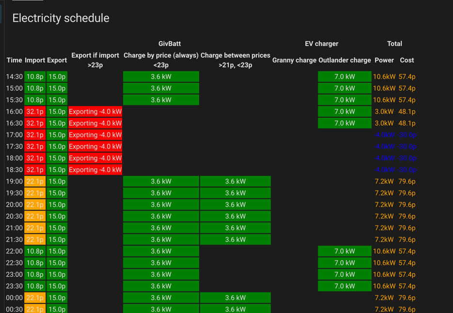

# Home Assistant Electricity Schedule Card

## What is this repository?

This is a Home Assistant Lovelace card to display scheduled energy usage against cost, for variable-price tariffs.

To use this plugin you'll need
* [Home Assistant](https://www.home-assistant.io/)
* An [Octopus Energy](https://share.octopus.energy/flax-otter-889) account
* [HACS](https://www.hacs.xyz/) (for installation - optional, but recommended)
* [BottlecapDave's Octopus integration](https://github.com/BottlecapDave/HomeAssistant-OctopusEnergy) for Home Assistant

## Credits

This plugin was heavily inspired by [Lozzd's Octopus Energy Rates Card](https://github.com/lozzd/octopus-energy-rates-card).
